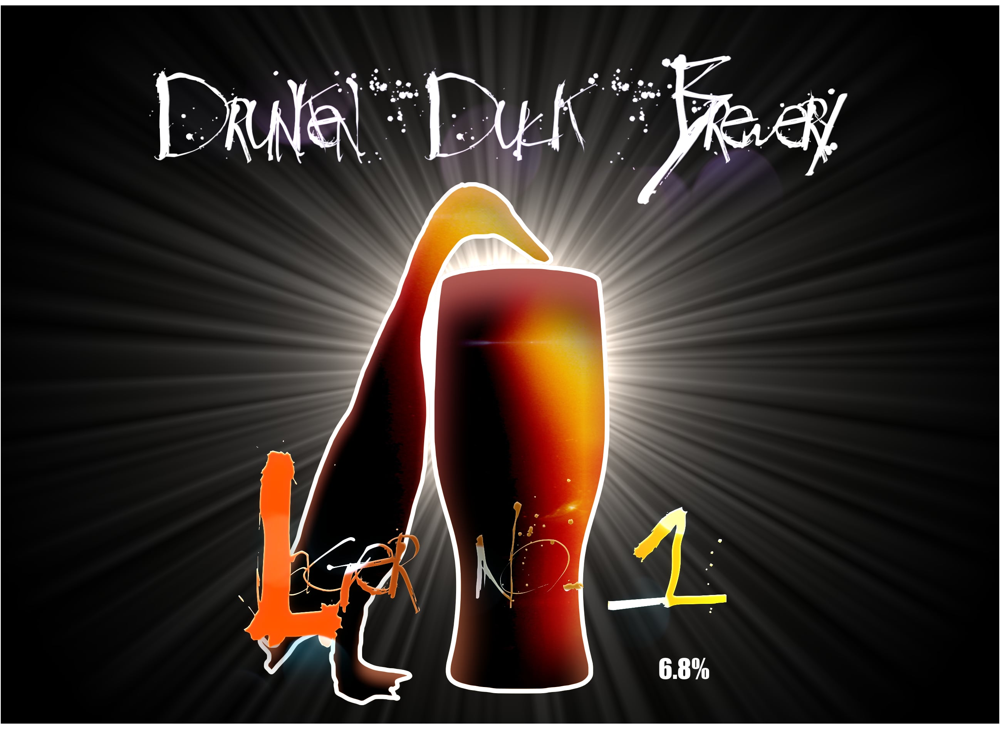
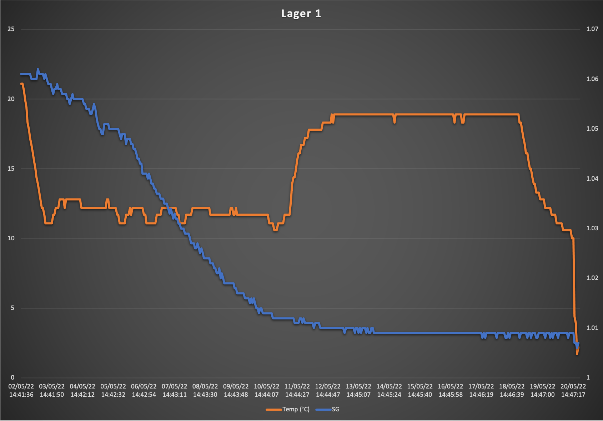
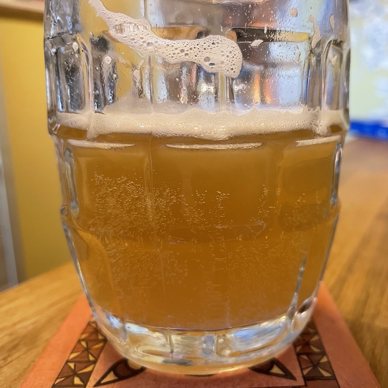

# Lager #1

Yup, I changed the barrel label. The cartoon duck felt a bit cartoonish. I'd like to be sleeker.

## Ingredients

For a 13 litre batch, as at [Malt Miller](https://www.themaltmiller.co.uk/rg/?id=268398)

| Grain                          | Quantity |
| ------------------------------ | -------- |
| Bestmalz Pilsner               | 1250g    |
| Crisp Lager Malt (Europils)    | 1250g    |
| Weyermann Carapils             | 250g     |

* Mash water: 17 litres
* Sparge water: 1 litre

| Additions                              | Quantity | Time         |
| -------------------------------------- | -------- | ------------ |
| Saaz Hops                              | 25g      | Start        |
| Saaz hops                              | 10g      | 30           |
| Irish Moss (rehydrated)                             | 5g       | 15 |
| Clarity Ferm | 6ml         |  Fermentation |
| Lallemand diamond lager Yeast |          |  Fermentation |

## Estimates

From [brewers friend](https://www.brewersfriend.com)

| OG    | FG    | Calories     | Carbs         | ABV  | IBU  | SRM  |
| ----- | ----- | ------------ | ------------- |---- | ---- | ---- |
| 1.061 | 1.012 | 186 per 330ml | 17.1 per 330ml | 6.4% | 35   | 4.1   |

The [BJCP SRM guide](https://www.brewersfriend.com/2017/05/07/beer-styles-srm-color-chart-2017-update/) suggests my recipe should produce the correct colour for the lager style.

## Process
Lager is meant to be the hardest beer style to perfect, so this is merely the first experiment in what I suspect will be a long journey.

As lager is meant to be crisp and clear, it's also an experiment in making the clearest beer I can. To start with I shall use tescos cheapest mineral water rather than tap to reduce sediment.

It's also my first time doing a multi stage mash. I know the brewzilla is programmable to manage this for me, but i'm going to do it by hand just to that i can keep a watch on what's going on.

The mashing stages are:

| Time | Temperature |
| ---- | ----------- |
| 10 minutes | 52C |
| 10 minutes | 62C |
| 10 minutes | 65C |
| 30 minutes | 72C |

Following the mash out there was a quick sparge with 1 litre of water (the constant sparging with the pump means I shouldn't need a large sparge at the end) and some lipohop was added.
Then the wort was boiled for 90 minutes.

Near the end of the boil I added the immersion cooler to sanitise it.
After 72 hours the kettle was given a further 15 minute boil with the rest of the additions added before once again chilling to 25C, then aerating and transferring to a fermenter and adding the second Belgian yeast.

## Fermentation

Clarify form was pitched to help remove gluten haze.

Lager yeast was pitched at 20C then the fridge was used to maintain 12C during fermentation.

After the target FG was reached and fermentation slowed I raised the temperate to 20C for a few days of diacetyl rest to help the yeast clear up, then cold crashed to 3C. Both these steps should help to clarify the beer even more.

## Actual figures

| Field       | Target         | Actual |
| ----------- | ------------- | ---------- |
| OG          | 1.061      |1.061 |
| FG          | 1.012      |1.09|
| ABV         | 6.4%    |6.8%|

## Graph
This shows the 12C maintained during fermentation, the 20C diacetyl rest and the cold crash.

## Kegging

Beer was siphoned to a keg and left to rest for two days before gassing as per the
[ kegerator instructions](https://learn.kegerator.com/force-carbonating-beer/) and  [calculator](https://www.brewersfriend.com/keg-carbonation-calculator/  ).

this suggests I should set the gas regulator to 27 PSI and leave in the garage for a couple of weeks before drinking.

## Tasting notes

Looks like a lager, tastes like a lager!
It could be clearer, but i've had far worse commericially.
Now I just need one final test to see how refreshing it is in the June sun...

## Lessons learnt
* Rehydrate Irish moss 15 min before adding, it works much better that way
* Longer boil loses more fluid. Next time, use all 20l.
* Not all fluid is useable. It's better to make more and lose some rather than made 10l and lose 3l, as that leave me with just 7l of drinkable beer.
* If I lose too much to the boil, extra water can be added before cooling and fermenting. Added water after fermentation will introduce O2, which is bad.
* Can clean everything the day before so it just needs turning on in the morning - this shrinks a brew day for ~4 hours.
* Lipohop and no lid stops bubbles
* Whirlpool before transferring to fermenter and using tap rather than pump will leave more sediment in the kettle, leading to a clearer beer.
* Can also add gelatine to the keg, leave a couple of days and waste the bottom pint to clear it further, although this violates the vegan principles.
* Keep an eye on the keg rubber ring when removing the lid.
* Remember to burp the keg once you start gassing to remove any oxygen.
* First attempt at a brew Fridge wasn't very good, the bottom was cooling much more than the top, and trying to fix this broke the gas line. Time for a new fridge!
